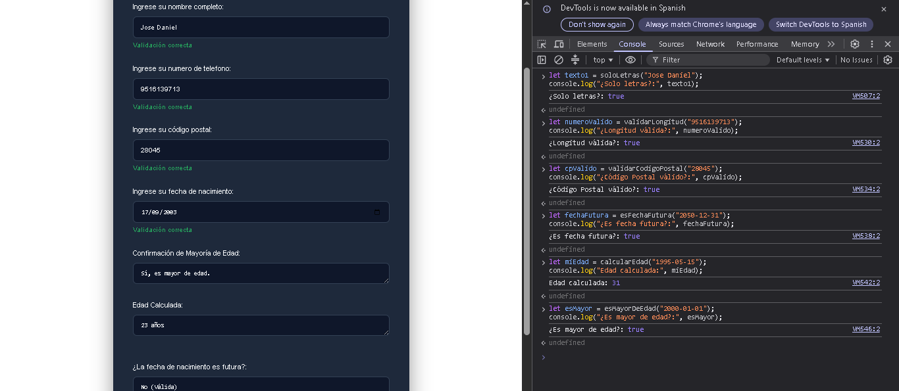
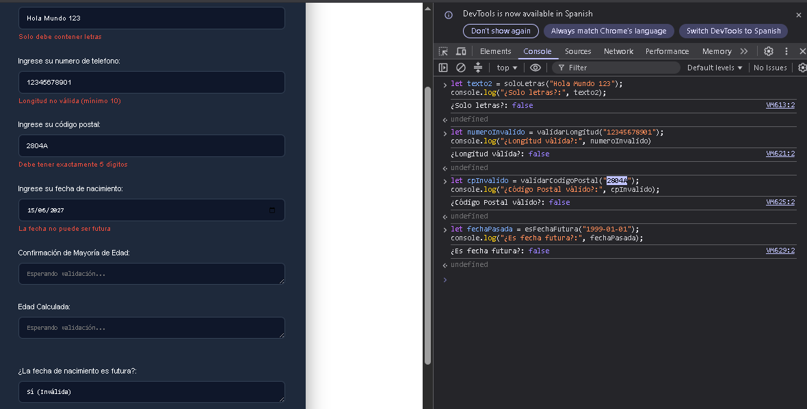
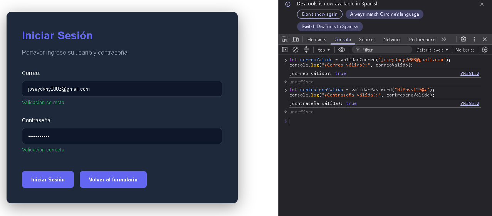
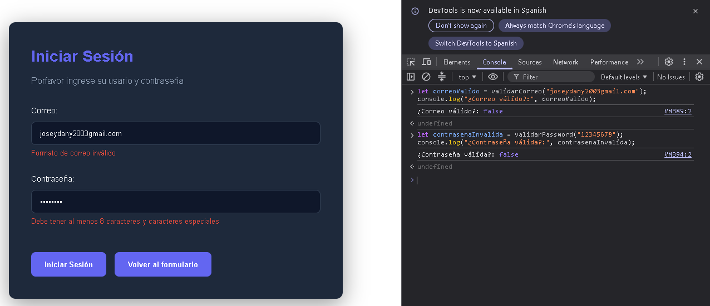

# Libreria: Utileria.js 

**Autor:** Rodriguez Juarez Jose Daniel

**Materia:** Programación Web  

**GitHub Pages:** `https://dany-502.github.io/Actividad-2-Libreria-utileria.js/`  

---
**¿Qué problema resuelve?**

Utileria.js es una librería ligera de JavaScript diseñada para simplificar y agilizar el desarrollo web. 
Evita tener que reescribir funciones comunes de validación y cálculos en cada nuevo proyecto. Con esta libreria cuentas con un conjunto de funciones listas para usar que validan correos, contraseñas, números, fechas y realizan cálculos de edad, asegurando que los datos de tus formularios sean correctos antes de enviarlos.

---

## Instalación 

Para usar Utileria.js en tu proyecto, simplemente descarga el archivo `utileria.js` y agrégalo a tu documento HTML usando la etiqueta `<script>`.

```html
<script src="js/utileria.js"></script>
```


## Funciones y Ejemplos de Código 

A continuación, se muestran ejemplos de cómo utilizar cada una de las funciones incluidas en la librería.

### 1. Validar Correo Electrónico
Valida si una cadena de texto tiene un formato de correo electrónico correcto.

```javascript
let correoValido = validarCorreo("joseydany2003@gmail.com");
console.log("¿Correo válido?:", correoValido); // devuelve true

let correoInvalido = validarCorreo("joseydany2003gmial.com");
console.log("¿Correo válido?:", correoInvalido); // devuelve false
```

### 2. Validar Solo Letras
Verifica si el texto ingresado contiene únicamente letras.

```javascript
let texto1 = soloLetras("Danielito");
console.log("¿Solo letras?:", texto1); // devuelve true

let texto2 = soloLetras("Hola Mundo 123");
console.log("¿Solo letras?:", texto2); // devuelve false
```

### 3. Validar Longitud de un Número
Verifica si la longitud de un número (o texto numérico) es menor o igual a 10 caracteres.

```javascript
let numeroValido = validarLongitud("1234567890");
console.log("¿Longitud válida?:", numeroValido); // devuelve true

let numeroInvalido = validarLongitud("12345678901");
console.log("¿Longitud válida?:", numeroInvalido); // devuelve false
```

### 4. Calcular Edad
Calcula la edad en años a partir de una fecha de nacimiento (YYYY-MM-DD).

```javascript
let miEdad = calcularEdad("1995-05-15");
console.log("Edad calculada:", miEdad); // Ej: 29 (esto depende del año actual)
```

### 5. Verificar si es Mayor de Edad
Valida si, a partir de una fecha de nacimiento, la persona tiene 18 años o más.

```javascript
let esMayor = esMayorDeEdad("2000-01-01");
console.log("¿Es mayor de edad?:", esMayor); // devuelve true

let esMenor = esMayorDeEdad("2015-10-20");
console.log("¿Es mayor de edad?:", esMenor); // devuelve false
```

### 6. Validar Contraseña
Verifica el formato de una contraseña (caracteres permitidos y longitud mínima de 8).

```javascript
let contrasenaValida = validarPassword("MiPass123@#");
console.log("¿Contraseña válida?:", contrasenaValida); // devuelve true
```
```javascript
let contrasenaInvalida = validarPassword("12345678");
console.log("¿Contraseña válida?:", contrasenaInvalida); // devuelve false
```

### 7. Validar Código Postal
Valida que el código postal contenga exactamente 5 dígitos numéricos.

```javascript
let cpValido = validarCodigoPostal("28045");
console.log("¿Código Postal válido?:", cpValido); // devuelve true

let cpInvalido = validarCodigoPostal("2804A");
console.log("¿Código Postal válido?:", cpInvalido); // devuelve false
```

### 8. Es Fecha Futura
Verifica si una fecha proporcionada es posterior a la fecha de hoy.

```javascript
let fechaFutura = esFechaFutura("2050-12-31");
console.log("¿Es fecha futura?:", fechaFutura); // devuelve true

let fechaPasada = esFechaFutura("1999-01-01");
console.log("¿Es fecha futura?:", fechaPasada); // devuelve false
```

---

## Capturas de Pantalla 

### 1. Formulario Principal - Validaciones Correctas

**Descripción:** Muestra la consola y la interfaz del formulario principal cuando todos los datos ingresados cumplen con los criterios estipulados en la librería.

**Validaciones probadas:**
- `soloLetras()` (Nombre)
- `validarLongitud()` (Número de teléfono)
- `validarCodigoPostal()` (Código postal)
- `calcularEdad()`, `esMayorDeEdad()` y `esFechaFutura()` (Fecha de nacimiento)

### 2. Formulario Principal - Validaciones Incorrectas

**Descripción:** Muestra la consola y la respuesta de la interfaz resaltando los errores de captura cuando los datos violan las reglas de validación.

**Validaciones probadas:**
- `soloLetras()` (Nombre con números o símbolos no permitidos)
- `validarLongitud()` (Número de teléfono excediendo el límite)
- `validarCodigoPostal()` (Código postal incompleto o con letras)
- `esMayorDeEdad()` y `esFechaFutura()` (Fecha no permitida o ilógica)

### 3. Inicio de Sesión - Datos Correctos

**Descripción:** Muestra la pantalla de inicio de sesión (login) evaluando positivamente cuando el correo y la contraseña tienen el formato correcto.

**Validaciones probadas:**
- `validarCorreo()` (Formato válido con @ y dominio)
- `validarPassword()` (Contraseña fuerte cumpliendo todos los requisitos)

### 4. Inicio de Sesión - Datos Incorrectos

**Descripción:** Muestra la pantalla de inicio de sesión detectando errores de formato y omisiones en las credenciales proporcionadas.

**Validaciones probadas:**
- `validarCorreo()` (Correo mal escrito, sin dominio o caracteres inválidos)
- `validarPassword()` (Contraseña débil, corta o carente de símbolos especiales)

---

## Demo en Video 


[Video_Promocional](#

https://github.com/user-attachments/assets/632ac5b7-8d46-4ac6-9a26-fd77f9633010

)
